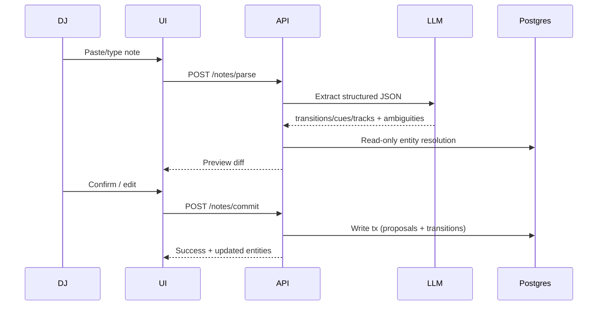
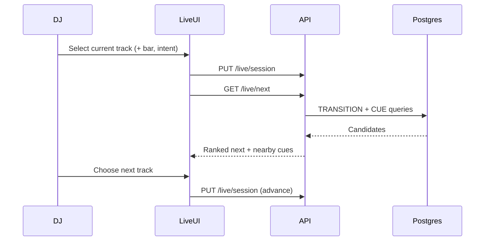

# Selecta — Architecture Plan

<!-- Product + GitHub repo: selecta. Package scope: @selecta/*. -->

> Status: historical planning record — storage decision superseded by
> [`PG_MIGRATION_REFACTOR.md`](./PG_MIGRATION_REFACTOR.md) (single Postgres).
> Product model: [`NEXT_PRODUCT_ARCHITECTURE.md`](./NEXT_PRODUCT_ARCHITECTURE.md).
> Last updated: 2026-08-20 (DJ-136: `notes` → `submissions` in live schema; this file keeps historical `/notes` endpoint names)
> Linear: DJ Project team document (see “Linear tracking” below)

---

## 1. Product vision

A **DJ-helping note-taking app** where DJs capture knowledge about tracks and transitions in **natural language**. Those notes are automatically parsed into a **personal music library** (tracks + transitions in Postgres) so that, during a live set, the DJ can update “I am on track X (around bar N)” and instantly see:

- Which tracks are good next
- Why each transition works (technique, timing, energy intent)
- Intra-track opportunities (loops, hype builds, cool-downs) that are not track→track edges

**Near-term focus:** NL → structured graph notes + a live “what’s next” UX.  
**Far-term (explicitly out of scope for v1):** music embeddings, auto-suggested paths, DJ software sync (Serato / Rekordbox / Traktor / VirtualDJ).

### Core user promise

> Write how you think about mixing. Play with a graph that thinks the same way.

---

## 2. Problem framing

DJs accumulate tribal knowledge that is hard to reuse under pressure:

| Knowledge type   | Example                                             | Graph shape                                 |
| ---------------- | --------------------------------------------------- | ------------------------------------------- |
| Transition       | “A → B at bar 16 with HPF, great for building hype” | `Track -[:TRANSITION]-> Track` + edge props |
| Intra-track cue  | “At bar 32 on track A, 4-bar loop builds hype”      | `Track -[:HAS_CUE]-> Cue`                   |
| Artist / catalog | “Other tracks by this artist”                       | `Artist -[:BY]-> Track`                     |
| Genre            | “UKG / techno — multi-tag”                          | `Track -[:IN_GENRE]-> Genre` (many edges)   |
| Track metadata   | BPM, key, energy                                    | `Track` **properties** (scalars)            |
| Set context      | Current track + energy goal                         | Postgres session → Cypher over music graph  |

The product is **not** a DAW or mixer. It is a **knowledge + decision surface** for live performance.

---

## 3. Design principles

1. **Notes first, schema second** — DJs write plain language; the system proposes structure; humans confirm when ambiguous.
2. **Postgres is the source of truth for relationships** — transitions (and later cues) live in music-domain tables; raw note text is retained for audit/replay.
3. **Live mode is glanceable** — large type, few taps, phone/tablet friendly; no dense dashboards during a set.
4. **Intentional vocabulary, not rigid ontology** — seed controlled terms (`build_hype`, `cool_down`, `hpf`, `loop`) but allow free-form labels that can be normalized later.
5. **Confirm before mutate (early)** — NL extraction returns a preview/review path; clear proposals auto-commit via deterministic policy. Auto-commit trust grows with dogfood.
6. **Single-store music knowledge** — users/auth/sessions stay app tables; tracks/transitions are traversable musical knowledge in the same Postgres.
7. **Multi-tenant via membership** — Postgres library↔track IDs scope all music queries (even if v1 UX is single-user).

---

## 4. Storage: one Postgres (supersedes Neo4j split)

> **Superseded (DJ-80 / PG-1…PG-5).** The locked decision below was the v1
> plan. Current state: **one Postgres owns everything** — submissions,
> proposals/review/audit, **and** the music domain (tracks, artists, genres,
> subgenres, folders, transitions). See
> [`PG_MIGRATION_REFACTOR.md`](./PG_MIGRATION_REFACTOR.md) §3 for tables and
> [`NEXT_PRODUCT_ARCHITECTURE.md`](./NEXT_PRODUCT_ARCHITECTURE.md) §2 / §10 for
> invariants. Neo4j / Aura are removed from the stack.

~~**Decision (locked): split stores. Neo4j holds only musical knowledge.**~~

| Store         | Owns (historical plan)                                                                                   | Current        |
| ------------- | -------------------------------------------------------------------------------------------------------- | -------------- |
| **Postgres**  | Users/auth, libraries, sessions, raw notes + extraction, membership, app audit **+ music domain tables** | **sole store** |
| ~~**Neo4j**~~ | ~~Tracks, artists, genres, transitions, cues~~                                                           | **removed**    |

### Why the split was reconsidered

The two-store design forced an idempotent saga (no cross-DB transaction),
application-level joins, and dual drivers/health/env. At library scale
(thousands of tracks/edges, 1–2 hop queries) Postgres is enough; see
`PG_MIGRATION_REFACTOR.md` §1–2 for the decision record.

### Tenancy (unchanged intent)

- Membership remains a relational concern (`library_id` on tracks / future
  membership tables) — not a User node walk.
- Artists/genres/subgenres/folders are shared vocabulary rows (`name_normalized`
  unique); tracks remain library-scoped.

---

## 5. Domain model

### 5.1 Primary entities

```
Postgres (sole store):
  User → Library → membership → trackIds
  Note / Submission (raw NL + extraction)
  Session (live runtime)
  Track ↔ Artist / Genre / Subgenre / Folder
  Track ──transitions──► Track
  (Cue later)
```

### 5.2 Node vs property decision rule

Promote to a **node** when most of these are true:

1. **Shared identity** — reused across many tracks (Artist, Genre)
2. **Traversal hub** — you want queries like “track → artist → other tracks” or “genre → tracks”
3. **Own relationships later** — e.g. `(:Artist)-[:SIMILAR_TO]->(:Artist)`, `(:Genre)-[:RELATED_TO]->(:Genre)`
4. **Many-to-many** — a track has multiple genres; encoding as a CSV property fights the graph
5. **First-class UI object** — browsable/filterable entity, not just a field on a form

Keep as a **property** when most of these are true:

1. **Scalar attribute of one entity** — BPM, key, duration, energy score
2. **Not a useful hub** — you rarely start a query _from_ that value as an entity
3. **High-cardinality / free text** — titles, rationale notes, external ID strings
4. **Edge-local fact** — `fromBar`, `toBar`, `barsOverlap`, `quality` on a specific transition
5. **Enum that only filters one relationship type** — can start as an edge property; promote later if it becomes a hub

| Concept                                     | v1 shape                                                          | Why                                                      |
| ------------------------------------------- | ----------------------------------------------------------------- | -------------------------------------------------------- |
| Track                                       | **Node**                                                          | Central entity                                           |
| Artist                                      | **Node** (required ≥1 via `BY`)                                   | Traverse track→artist→tracks; future similarity          |
| Genre                                       | **Node** + `IN_GENRE` edges (required ≥1)                         | Multi-genre; traverse genre→tracks                       |
| Cue                                         | **Node**                                                          | Time-anchored object with its own fields; many per track |
| Transition                                  | **Relationship**                                                  | Directed mix fact between two tracks                     |
| BPM / key / energy / duration               | **Track properties**                                              | Scalars; filtering ok via indexes, not hubs              |
| Title                                       | **Track property**                                                | Identity string, not a hub                               |
| Transition bars / overlap / quality / notes | **Edge properties**                                               | Local to that mix instance                               |
| Intent (`build_hype`, …)                    | **Edge/Cue property in v1** → optional **Intent node** in Phase 2 | Start simple; promote when faceting/analytics need hubs  |
| Technique (`hpf`, `bass_swap`, …)           | **Edge/Cue property in v1** → optional **Technique node** later   | Same as intent                                           |
| User / Note / Session                       | **Postgres only**                                                 | Not musical graph                                        |

**Rule of thumb:** if you would ever write “find all X connected through Y”, Y is probably a node. If you would write “filter tracks where field = value”, it can stay a property.

### 5.3 Track

| Field         | Required    | Notes                                               |
| ------------- | ----------- | --------------------------------------------------- |
| `id`          | yes         | UUID (also referenced from Postgres membership)     |
| `title`       | yes         | Display / search                                    |
| `bpm`         | no          | Float                                               |
| `musicalKey`  | no          | Camelot / open key string                           |
| `durationSec` | no          |                                                     |
| `energy`      | no          | Ordinal or 0–1                                      |
| `externalIds` | no          | Map/JSON-ish for Spotify, Beatport, Rekordbox later |
| `libraryId`   | recommended | Defense-in-depth scope (mirrors Postgres)           |

**Not track properties:** artist name, genre list — those are relationships.

Creating a track requires:

- ≥1 `(:Artist)-[:BY]->(:Track)` (primary artist first; features allowed as additional `BY` or later `FEATURES`)
- ≥1 `(:Track)-[:IN_GENRE]->(:Genre)`

### 5.4 Artist

| Field            | Required | Notes                                      |
| ---------------- | -------- | ------------------------------------------ |
| `id`             | yes      | UUID                                       |
| `name`           | yes      | Canonical display name                     |
| `nameNormalized` | yes      | Lowercased / stripped for MERGE uniqueness |

Relationships:

```cypher
(:Artist)-[:BY]->(:Track)                 // required for every track
// Phase 3+:
(:Artist)-[:SIMILAR_TO {score?, notes?}]->(:Artist)
```

Traversal example: current track → artist → other tracks by same artist (excluding current), useful as Live Mode fallback when few transitions exist.

### 5.5 Genre

| Field            | Required | Notes                         |
| ---------------- | -------- | ----------------------------- |
| `id`             | yes      | UUID                          |
| `name`           | yes      | e.g. `techno`, `ukg`, `disco` |
| `nameNormalized` | yes      | For MERGE                     |

Relationships:

```cypher
(:Track)-[:IN_GENRE]->(:Genre)            // multi-genre via multiple edges
// Optional later:
(:Genre)-[:RELATED_TO]->(:Genre)
```

Direction note: either `Track-[:IN_GENRE]->Genre` or `Genre-[:HAS_SONG]->Track` works. Prefer **`Track-[:IN_GENRE]->Genre`** so track-centric queries stay outgoing from the current track; genre browse is just a reverse traverse.

### 5.6 Transition (edge)

Directed relationship `(:Track)-[:TRANSITION]->(:Track)` with properties:

| Property                  | Example                  | Purpose                                 |
| ------------------------- | ------------------------ | --------------------------------------- |
| `fromBar`                 | `16`                     | When to leave outgoing track            |
| `toBar`                   | `1` or `32`              | Where to enter incoming track           |
| `technique`               | `high_pass_filter`       | How (property v1; node later if needed) |
| `intent`                  | `build_hype`             | Why / energy role (property v1)         |
| `quality`                 | `great` / `ok` / `risky` | Preference                              |
| `notes`                   | free text                | Human rationale                         |
| `barsOverlap`             | `8`                      | Blend length                            |
| `sourceNoteId`            | UUID                     | FK-ish to Postgres `notes.id`           |
| `createdAt` / `updatedAt` | ISO timestamps           | Lifecycle                               |

Multiple transitions between the same pair are allowed (different techniques/intents).

### 5.7 Intra-track cues (nodes)

```cypher
(:Track)-[:HAS_CUE]->(:Cue {
  id, bar, barEnd?, kind, intent, technique, notes, quality, sourceNoteId
})
```

Example `kind` values: `loop_opportunity`, `hype_build`, `vocal_drop`, `breakdown`, `mix_out_window`, `acapella_moment`.

### 5.8 Session

| Field            | Description                              |
| ---------------- | ---------------------------------------- |
| `currentTrackId` | Now playing (track id)                   |
| `currentBar`     | Approximate position (manual for v1)     |
| `energyGoal`     | Optional filter: build / cool / maintain |
| `recentTrackIds` | Avoid immediate repeats                  |
| `setId`          | Optional grouping of a night             |

---

## 6. Music domain schema (historical Neo4j proposal — superseded)

> **Superseded.** The Cypher labels/relationships below were the v1 graph
> sketch. Current schema is relational Postgres in `@selecta/db` — see
> [`PG_MIGRATION_REFACTOR.md`](./PG_MIGRATION_REFACTOR.md) §3
> (`tracks`, join tables, `transitions`, vocabulary). Live “what’s next” and
> neighborhood reads use SQL (joins / recursive CTE later), not Cypher.

### 6.1–6.7 Historical Neo4j examples (archive only)

The following Cypher snippets are kept as design archaeology. Do not implement
against them.

<details>
<summary>Archived Neo4j node/relationship sketch</summary>

### 6.1 Node labels (music only)

- `Track`, `Artist`, `Genre`, `Cue`
- Phase 2+ (optional): `Intent`, `Technique`

**Explicitly not in Neo4j (historical):** `User`, `Note`, `Session`, `Library`.

### 6.2 Relationships

```cypher
(:Artist)-[:BY]->(:Track)
(:Track)-[:IN_GENRE]->(:Genre)
(:Track)-[:TRANSITION { ... }]->(:Track)
(:Track)-[:HAS_CUE]->(:Cue)
```

### 6.4 Example — live “what’s next” (historical Cypher)

```cypher
MATCH (current:Track {id: $currentTrackId})
MATCH (current)-[t:TRANSITION]->(next:Track)
WHERE ($intent IS NULL OR t.intent = $intent)
  AND NOT next.id IN $recentTrackIds
  AND next.id IN $allowedTrackIds
RETURN next, t
ORDER BY
  CASE t.quality WHEN 'great' THEN 0 WHEN 'ok' THEN 1 ELSE 2 END,
  coalesce(t.fromBar, 0)
LIMIT 20
```

</details>

---

## 7. Natural language → graph pipeline

### 7.1 Intake UX

Two complementary input surfaces:

1. **Quick capture** — single text box: “Transition A into B at 16 with HPF, builds hype”
2. **Structured assist** — optional form fields after parse (track pickers, bar numbers, intent chips)

Keep raw text forever; show a **proposed graph diff** before commit.

### 7.2 Pipeline stages

```
[Raw note text]  (durable save first)
      │
      ▼
1. One-shot LLM structured draft (no tools; cheap)
      │
      ▼
2. Deterministic resolve (local library → Spotify unique match)
      │
      ▼
3. Deterministic policy gates (confidence, uniqueness, limits)
      │
      ├── needs_review → persist reasons for DJ-36 UI
      │
      └── auto path → idempotent Spotify import + TRANSITION MERGE
      │
      ▼
4. Postgres agent-run audit + note extraction status (CAS by version)
```

The model never searches or mutates music tables directly; deterministic application code is the only writer.
Parse lives in `@selecta/agentics/submission-parser`. Resolve, decide, and apply live in `@selecta/submissions` (`src/pipeline/`).
`@selecta/agentics` remains available for future multi-step agents.

### 7.3 Extraction schema (conceptual)

```json
{
  "noteType": "transition | cue | track_note | mixed",
  "tracks": [
    {
      "mention": "track A",
      "resolvedId": null,
      "titleHint": "...",
      "artists": [{ "mention": "Artist Name", "resolvedId": null }],
      "genres": [{ "mention": "techno", "resolvedId": null }]
    }
  ],
  "transitions": [
    {
      "fromMention": "track A",
      "toMention": "track B",
      "fromBar": 16,
      "toBar": null,
      "technique": "high_pass_filter",
      "intent": "build_hype",
      "quality": "great",
      "notes": "original rationale"
    }
  ],
  "cues": [
    {
      "trackMention": "track A",
      "bar": 32,
      "barEnd": 36,
      "kind": "loop_opportunity",
      "intent": "build_hype",
      "technique": "4_bar_loop",
      "notes": "..."
    }
  ],
  "trackUpdates": [{ "trackMention": "track A", "bpm": 128, "energy": 0.8 }],
  "confidence": 0.0,
  "ambiguities": ["Which 'Midnight' track?", "Genre 'house' vs 'tech house'?"]
}
```

### 7.4 Ambiguity handling

- Fuzzy track match → picker UI
- Missing bars/technique → allow partial save
- Low confidence → force confirm
- Mixed notes (transition + cue) → multi-op commit in one transaction

### 7.5 LLM / AI placement

- Use structured output (JSON schema) via AI SDK / gateway
- Keep prompts versioned; store `model`, `promptVersion`, `rawResponse` on `Note`
- Do **not** require AI for Live Mode queries — those are pure SQL
- Future: embeddings on tracks/transitions for “similar vibe” suggestions

---

## 8. Application architecture

### 8.1 Clean topology (locked)

**Four things only:**

1. **Frontend + Backend** — Next.js apps on Vercel (`@selecta/web`, `@selecta/api`)
2. **Postgres** — app state **and** music domain (sole store)
3. **AI Gateway** (managed call from the app) — NL extraction only; not a service we operate

~~3. Neo4j Aura — music graph~~ — **removed (PG-5).**

No separate Go/Python API. No message bus. No extra BFF. Split a worker later only if profiling demands it (embeddings batch, DJ-software sync daemons).

```
┌──────────────────────────────────────┐
│  Browser (Live Mode / Library)       │
└──────────────────┬───────────────────┘
                   │ HTTPS (same origin / rewrite)
                   ▼
┌──────────────────────────────────────┐
│  Next.js on Vercel (Fluid Compute)   │
│  UI (shadcn) + Route Handlers /      │
│  Server Actions + server modules     │
└──────────────────┬───────────────────┘
                   │
                   ▼
            ┌──────────┐
            │ Postgres │
            │ (all)    │
            └──────────┘
                   │
                   └──► AI Gateway (parse notes only)
```

### 8.2 Backend: Next.js vs Go/Python

| Option                         | Pros                                                                    | Cons                                                                                          |
| ------------------------------ | ----------------------------------------------------------------------- | --------------------------------------------------------------------------------------------- |
| **Next.js fullstack (chosen)** | One deploy, one auth boundary, zero extra hops, shared types, least ops | CPU-heavy long jobs less ideal later                                                          |
| Separate Go/Python API         | Fine for heavy compute / strict isolation                               | Extra service, extra latency hop, duplicated auth, more infra — fights “clean + few services” |

**Locked for v1–3:** Next.js is the backend. Live Mode and neighborhood reads are SQL + membership checks — Node on Fluid Compute is fast enough. Revisit a worker/service only for Phase 4+ batch intelligence or Phase 5 sync adapters.

### 8.3 Suggested tech stack (locked)

| Layer    | Choice                                        | Rationale                                                              |
| -------- | --------------------------------------------- | ---------------------------------------------------------------------- |
| App      | **Next.js App Router + TypeScript** on Vercel | Single deployable = cleanest architecture                              |
| UI       | **shadcn/ui + Tailwind**                      | Accessible primitives; Live Mode can still be custom/composition-light |
| Auth     | Clerk (or Auth.js)                            | Stays in the Next app                                                  |
| API      | Route Handlers + Server Actions               | Same-origin, typed, no separate API host                               |
| Graph DB | ~~Neo4j Aura~~ → **Postgres music tables**    | Single-store music domain (`@selecta/db`)                              |
| App DB   | Postgres (Neon / Marketplace)                 | Tenancy, sessions, notes, **and** music                                |
| AI       | Vercel AI Gateway + AI SDK structured output  | NL → JSON; not on Live Mode hot path                                   |
| Hosting  | Vercel Fluid Compute (Node)                   | Connection reuse, no edge runtime required                             |

**Not in v1:** separate Go/Python service, Redis (unless session cache proves necessary), Kafka/queues, microservice mesh.

### 8.4 Performance principles (Live Mode hot path)

Live Mode must feel instant. Design rules:

1. **No LLM on Live queries** — pure Postgres membership + SQL neighborhood.
2. **Minimize hops** — browser → Next server → Postgres. Never browser → API#2 → another store.
3. **Reuse connections** — PG pool as module singleton; Fluid Compute instance reuse keeps pools warm.
4. **Tight SQL** — parameterized queries, indexes on track/transition keys; return only fields Live UI needs.
5. **Parallelize independent reads** — e.g. `Promise.all` for outbound transitions + nearby cues (+ optional same-artist fallback).
6. **Cache membership allow-list briefly** in the request/server scope (not a separate Redis unless needed).
7. **Prefer Server Actions / RSC where they cut round-trips**; use Route Handlers for clear JSON endpoints (Live refresh).
8. **Region locality** — put Vercel and Postgres in the same region.

Target UX budget (guideline): Live “what’s next” **p95 &lt; 200–300ms** server time under normal library size.

### 8.5 Internal module layout (still one app)

Keep code clean with folders/modules — not separate deployables:

1. **`library` / music** — track/artist/genre CRUD in `@selecta/db`
2. **`notes` / submissions** — raw note storage (PG), parse, preview, commit
3. ~~**`graph`** — Neo4j driver~~ — **removed**; music helpers live in `@selecta/db`
4. **`live`** — session (PG) + next-options aggregation
5. **`resolution`** — entity matching / aliases

UI uses **shadcn** primitives (`Button`, `Command`, `Dialog`, `Input`, etc.). Live Mode composition stays glanceable — shadcn is the kit, not a dashboard aesthetic mandate.

### 8.6 API surface (conceptual)

| Method | Path                      | Purpose                                              |
| ------ | ------------------------- | ---------------------------------------------------- |
| `POST` | `/api/notes/parse`        | NL → structured preview (no write)                   |
| `POST` | `/api/notes/commit`       | Apply accepted preview to music tables + PG note row |
| `GET`  | `/api/tracks`             | Search/list (membership-scoped)                      |
| `POST` | `/api/tracks`             | Manual create (Artist + Genre required)              |
| `GET`  | `/api/tracks/:id`         | Track + cues + outbound transitions                  |
| `GET`  | `/api/live/next`          | Session → ranked next tracks + nearby cues           |
| `PUT`  | `/api/live/session`       | Update current track/bar/intent filter               |
| `GET`  | `/api/graph/neighborhood` | Optional explorer (prep mode)                        |

---

## 9. UX architecture

### 9.1 Modes

1. **Library / Notes mode** (prep)
   - Capture NL notes
   - Review extraction diffs
   - Browse tracks, edit transitions, inspect graph neighborhood

2. **Live mode** (performance)
   - Big current-track selector
   - Optional bar stepper (`-8 / +8` or number pad)
   - Intent chips: Build hype · Cool down · Maintain · Drop
   - Primary panel: **Next tracks** (title, why, technique, fromBar)
   - Secondary panel: **Do this now** (cues near current bar)
   - One-tap: “Play next” → advances session current track

### 9.2 Live Mode interaction loop

```
Set current track → (optional) set bar / intent
        │
        ▼
Query graph for outbound TRANSITION + nearby CUE
        │
        ▼
DJ picks a next track OR executes a cue
        │
        ▼
Update session (current = chosen next) → repeat
```

### 9.3 UX constraints for Live Mode

- Thumb-friendly; high contrast; minimal chrome
- Prefer 1 current context + 1 decision list (not a dashboard of widgets)
- Offline/degraded: cache last neighborhood for current track (phase 2)
- Mistaps are costly mid-set — confirm destructive edits only in Library mode

### 9.4 Library note review

Show a side-by-side:

- Left: original text
- Right: proposed ops (`CREATE Track`, `MERGE TRANSITION`, `CREATE Cue`)
- Actions: Accept all · Edit fields · Reject

---

## 10. Data flows

### 10.1 Capture flow



### 10.2 Live query flow



---

## 11. Ranking & filtering (live intelligence v1)

v1 ranking should be **transparent and rule-based**, not ML:

1. Filter by optional `intent`
2. Prefer `quality = great`
3. Prefer transitions whose `fromBar` is near `currentBar` (if bar known)
4. Deprioritize recently played
5. Optional soft filters: BPM delta, key compatibility (only if metadata present)

Surface the **reason string** in UI (“HPF @ bar 16 · build hype · marked great”) so the DJ trusts the suggestion.

---

## 12. Security, tenancy, and trust

- Tenancy lives in **Postgres** (library membership). Cypher receives an allow-list of track IDs (and optional `libraryId` property filter) — never a `User` node walk.
- Never interpolate user strings into Cypher — parameterized queries only.
- LLM outputs are untrusted: validate against schema; whitelist enums where possible; require resolved Artist + ≥1 Genre before track commit.
- Soft-delete or archive transitions rather than hard-delete mid-set.
- Export/import (JSON / Cypher dump) as a later reliability feature.

---

## 13. Repository / project structure (locked monorepo)

```
selecta/                     # monorepo root (github.com/astradzhao/selecta)
  apps/
    web/                     # Next.js UI (Vercel) — @selecta/web
    api/                     # Next.js API deployable (Vercel) — @selecta/api
  packages/
    db/                      # Postgres client + schema + migrations — @selecta/db
    library/                 # music domain — @selecta/library
    submissions/             # notes, proposals, extract pipeline — @selecta/submissions
    catalog/                 # External catalog search — @selecta/catalog
    agentics/                # bounded AI agent harness + NL parse — @selecta/agentics
    ui/                      # shadcn + shared UI — @selecta/ui
    eslint-config/           # shared ESLint — @selecta/eslint-config
  dev-files/                 # architecture, ADRs, prompts
```

pnpm workspace at repo root. Deployables live in `apps/`; shared domain/UI code lives in `packages/`. Do **not** invent additional deployables (workers, Go/Python services) in v1 unless a later phase explicitly unlocks them.

Suggested early `dev-files/` companions (later, not now):

- `GRAPH_SCHEMA.md` — concrete property dictionary
- `NL_EXTRACTION_PROMPT.md` — versioned prompt + examples
- `LIVE_UX.md` — wireframe notes
- `ROADMAP.md` — milestone checklist
- `ADR-001-nextjs-fullstack.md` — why no separate Go/Python API

---

## 14. Phased roadmap

### Phase 0 — Foundations (this doc)

- [x] Architecture plan
- [x] Lock stack: Next.js fullstack + shadcn + Vercel + **Postgres-only** (Neo4j removed)
- [ ] Seed vocabulary for intents/techniques
- [ ] Provision Postgres in the same region as Vercel

### Phase 1 — MVP vertical slice

**Goal:** Write a transition note → see it as a next-track option in Live Mode.

1. Auth + Postgres library membership
2. Manual track create with **required Artist + ≥1 Genre** (Postgres rows)
3. NL parse → preview → commit for **transitions only**
4. Postgres write/read of tracks / artists / genres / transitions
5. Live Mode: set current track → list outbound transitions → advance
6. Bonus fallback: same-artist suggestions when transitions are sparse

**Success metric:** A DJ can encode 10 transitions and run a short practice set using only Live Mode.

### Phase 2 — Cues & richer notes

1. Intra-track `Cue` extraction + Live “do this now”
2. Intent/technique chips + filters
3. Track property updates via NL (“this track is 124 BPM, peak energy”)
4. Duplicate track merge / aliases

### Phase 3 — Graph UX & quality

1. Neighborhood explorer (optional, prep mode only)
2. Transition quality feedback from Live Mode (“worked / failed”)
3. Better ranking (BPM/key soft scoring)
4. Mobile/PWA polish for booth use

### Phase 4 — Intelligence (future)

1. Embeddings over tracks + transition notes
2. Path suggestions for a target energy arc
3. Semi-automatic extraction without confirm for high-confidence notes

### Phase 5 — DJ software integrations (future)

1. Read now-playing from Rekordbox/Serato/etc.
2. Auto-update session current track
3. Optional bidirectional cues (non-blocking; treat as adapter layer)

---

## 15. Risks & open decisions

| Topic                          | Options                             | Recommendation                                                           |
| ------------------------------ | ----------------------------------- | ------------------------------------------------------------------------ |
| Neo4j only vs Neo4j + Postgres | Single store vs split               | **Superseded: single Postgres** (DJ-80) — see `PG_MIGRATION_REFACTOR.md` |
| User/Note in graph             | OWNS edges vs external membership   | **Locked: no User/Note as music entities** — membership in Postgres      |
| Artist / Genre modeling        | Properties vs nodes                 | **Locked: required nodes + edges**                                       |
| Backend shape                  | Next fullstack vs Go/Python service | **Locked: Next.js on Vercel** (fewest services, fewest hops)             |
| UI kit                         | Custom vs shadcn                    | **Locked: shadcn/ui + Tailwind**                                         |
| Auto-commit NL vs confirm      | Speed vs trust                      | Confirm in Phases 1–2                                                    |
| Cue as node vs properties      | Flexibility vs simplicity           | Cue nodes                                                                |
| Intent/Technique               | Edge props vs nodes                 | Props in v1; promote to nodes if faceting needs hubs                     |
| Artist uniqueness              | Per-library vs global MERGE         | Global `nameNormalized` MERGE; tracks stay library-scoped                |
| Bar tracking                   | Manual vs synced                    | Manual stepper in v1                                                     |
| Multi-device live              | Phone + laptop                      | PWA-friendly Live Mode early                                             |
| Ontology strictness            | Enums vs free text                  | Hybrid: seeded enums + `notes` free text                                 |
| Extra infra (Redis/queue)      | Add early vs defer                  | **Defer** until measured need                                            |

### Open product questions

1. Single-DJ personal tool first, or shared/collaborative libraries later?
2. Do we need set planning (ordered playlists) in MVP, or only reactive next-track?
3. How important is key/BPM compatibility in v1 vs pure human-encoded transitions?
4. Preferred booth device: phone, tablet, or laptop?
5. Should failed transitions be first-class (`quality: risky/fail`) from day one?
6. Features / remix credits: extra `BY` edges, or a separate `FEATURES` relationship?
7. Genre taxonomy: flat list first, or parent/child genres from day one?

---

## 16. Non-goals (v1)

- Real-time audio analysis
- Automatic beatmatching / stem separation
- Marketplace of shared transition graphs
- Full graph visualization as the primary Live UI
- Training custom music embedding models

---

## 17. Success criteria for the overall architecture

The architecture is “right” if:

1. A plain-English transition becomes a queryable edge within one confirm action.
2. Live Mode answers “what’s next?” in one screen with reasons.
3. Intra-track cues don’t pollute track→track topology.
4. Future embedding/DJ-software features can attach without rewriting the graph core.
5. Raw notes remain recoverable for re-extraction when the schema evolves.

---

## 18. Immediate next steps (when implementation starts)

1. Provision Postgres in the **same region** as the Vercel project
2. Scaffold Next.js app + shadcn + auth
3. Lock v1 property dictionary + Zod extraction schema
4. Implement Phase 1 vertical slice only (no extra services)
5. Seed 5–10 real transitions and measure Live `/api/live/next` latency

---

## Linear tracking

- Team: **DJ Project**
- Architecture doc: [Selecta — Architecture Plan](https://linear.app/dj-project-astradzhao/document/dj-graph-notes-architecture-plan-01bfac2a798b)
- Architecture issue (done): [DJ-5](https://linear.app/dj-project-astradzhao/issue/DJ-5/architecture-plan-nl-neo4j-dj-notes-app)
- **MVP project:** [MVP — NL → Graph → Live Mode](https://linear.app/dj-project-astradzhao/project/mvp-nl-graph-live-mode-08d4f2152899)
  - M0 [DJ-6](https://linear.app/dj-project-astradzhao/issue/DJ-6/m0-scaffold-nextjs-shadcn-vercel) → M1 [DJ-10](https://linear.app/dj-project-astradzhao/issue/DJ-10/m1-postgres-neo4j-data-layer) → M2 [DJ-8](https://linear.app/dj-project-astradzhao/issue/DJ-8/m2-track-library-with-artist-genre) → M3 [DJ-7](https://linear.app/dj-project-astradzhao/issue/DJ-7/m3-nl-parse-preview-commit-transitions) → M4 [DJ-11](https://linear.app/dj-project-astradzhao/issue/DJ-11/m4-live-mode-whats-next) → M5 [DJ-9](https://linear.app/dj-project-astradzhao/issue/DJ-9/m5-dogfood-seed-data-mvp-acceptance)

---

## Appendix A — Example notes the system should handle

1. “Track A into Track B at bar 16 with a high-pass filter — great for building hype.”
2. “On Track A at bar 32, 4-bar loop is a good hype build.”
3. “Don’t go from Track C to Track D — key clash, messy.” → `quality: risky` or negative edge later
4. “Track E is peak-time, ~128 BPM, major energy.” → track property update
5. “Echo out of Track F into Track G over 8 bars to cool down.”

## Appendix B — Glossary

| Term       | Meaning                                                                |
| ---------- | ---------------------------------------------------------------------- |
| Transition | Directed mix relationship from track A to track B                      |
| Cue        | Time-anchored opportunity on a single track                            |
| Artist     | Graph node; tracks connect via `BY`                                    |
| Genre      | Graph node; tracks connect via `IN_GENRE` (many-to-many)               |
| Intent     | Energy/role label (build hype, cool down, …) — edge/cue property in v1 |
| Technique  | Mixing method (HPF, bass swap, loop, …) — edge/cue property in v1      |
| Live Mode  | Performance UI driven by session state + graph queries                 |
| Extraction | NL → structured graph operations                                       |
| Membership | Postgres link from library/user → track ids                            |
